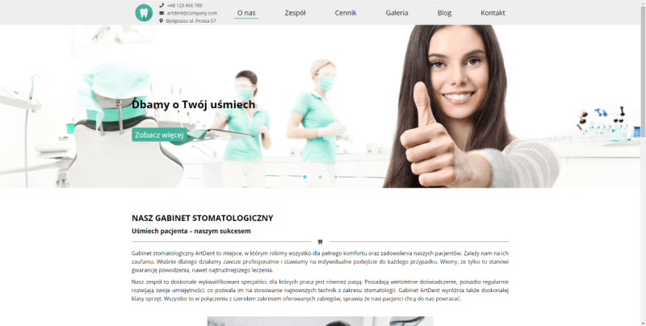

#  Dental Surgery
> Simple SPA using React.
> Website of fictional dental surgery.

## Table of contents
* [General info](#general-info)
* [Screenshots](#screenshots)
* [Technologies](#technologies)
* [Production Build](#production-build)
* [Status](#status)

## General info
My app is build with the use of only functional commponents and hooks. The app is compatible with devices of all sizes. Bootstrapped with Create React App.

## Screenshots
#### Desktop

#### Mobile

## Technologies
* React - version 16.3.1
* Create React App - version 3.4.1
* React Router - version 5.2.0
* Styled Components - version 5.1.0
* GSAP - version 3.2.6
* React Final Form - version 6.5.0

## Production build
Here is a link to production build: [link](https://roman1417.github.io/dental-surgery/)

## Status
Project is finished.